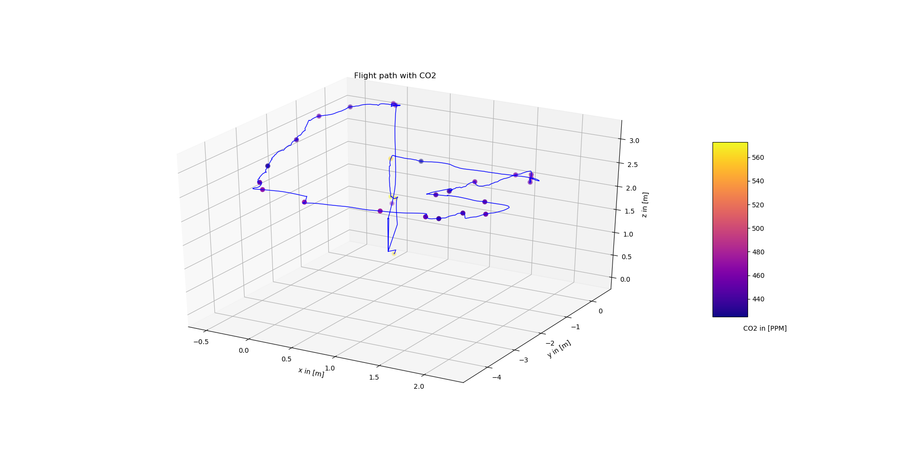

# Environmet Sensor Extension for Tello Drone 

## Overview

This is a [ROS] package used to listen on **Port 8080** to receive a UDP package from a another machine. In our case a 
[ESP8266 ESP-01S](https://www.az-delivery.de/products/esp8266-01), sends out UDP messages over a WiFi-connection
which contains the sensor measures. These measurements are then published as a ROS topic. This package provides nodes for 
the [BME680](https://www.adafruit.com/product/3660) and [SCD30](https://www.sparkfun.com/products/15112) sensors.

**BME680** provides measurements for:
* **temperature** in *C (float32)
* **pressure** in hPa (float32)
* **humidity** in % (float32)
* **gas_resistance** in kOhms (float32)
* **altitude** Approx. Altitude in m (float32)
* **iaq**	Air quality score 0 - 100 (uint8)

**SCD30** provides measurements for:
* **temperature** in *C (float32)
* **humidity** in % (float32)
* **co2** in PPM (uint16)

**Keywords:** BME680, SCD30, UDP, Socket Communication

### License

The source code is released under a [MIT license](../LICENSE).

**Author: Michael Wachl**  
Affiliation: 
* [Siemens](https://new.siemens.com/global/en.html) 
* [TUM-RCS](https://www.ei.tum.de/rcs/startseite/) 

Maintainer: Michael Wachl, michael.wachl@tum.de

This package has been tested under [ROS] Melodic and Ubuntu 18.04. This is research code, expect that it changes often and any fitness for a particular purpose is disclaimed.

### Publications

If you use this work in an academic context, please cite the following publication(s):

* Michael Wachl: **Monocular Vision-Based Indoor Object Detection and Localization on Autonomous MAV**. 

        @inproceedings{Wachl2020,
            author = {Michael Wachl},
            title = {{Monocular Vision-Based Indoor Object Detection and Localization on Autonomous MAV}},
            year = {2020}
        }

## Installation

### Dependencies

- [Robot Operating System (ROS)](http://wiki.ros.org) (middleware for robotics),

### Further preparation
Make sure you allow UDP communication over port 8080 on your machine.

### Building

To build from source, clone the latest version from this repository into your catkin workspace and compile the package using

	catkin_make

## Usage
If no roscore is running, start one with 
    
    roscore

Then Run the sensor node(s) with

	rosrun environment_sensor bme680_receive.py
or

    rosrun environment_sensor bme680_receive.py
depending on your sensor.

## Nodes

* `bme680_node`
* `scd30_node`

#### Subscribed Topics

This node listens on the **Port 8080** to receive UDP Packages from a microcontroller.

#### Published Topics

* **`/environment_sensor/scd30`** (environment_sensor.msg/SCD30)
* **`/environment_sensor/bme680`** (environment_sensor.msg/BME680)

## Bugs & Feature Requests

Please report bugs and request features using the [Issue Tracker](https://github.com/michaelwachl/autonomous_drone_plant_detection/issues).

