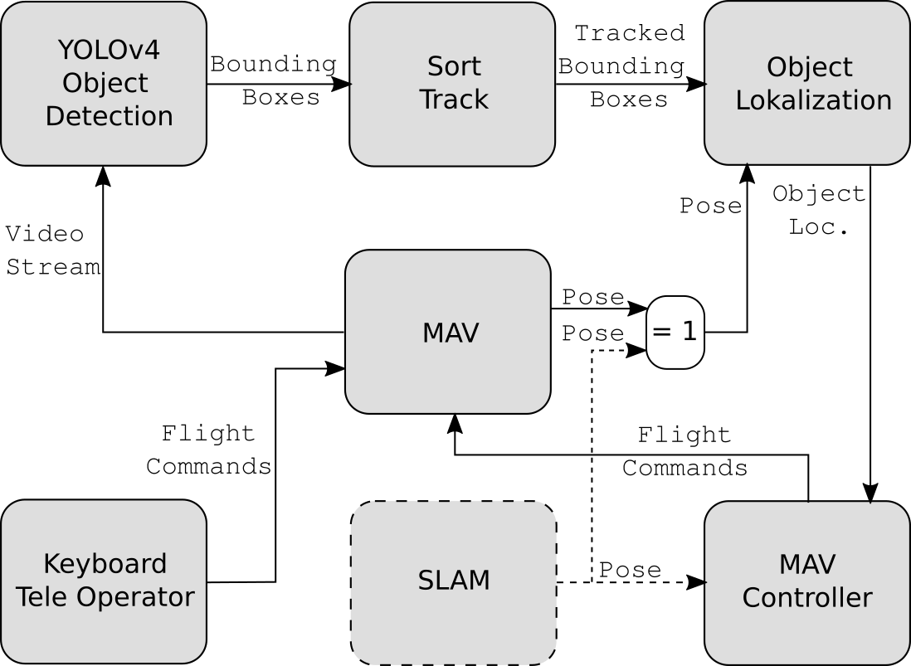
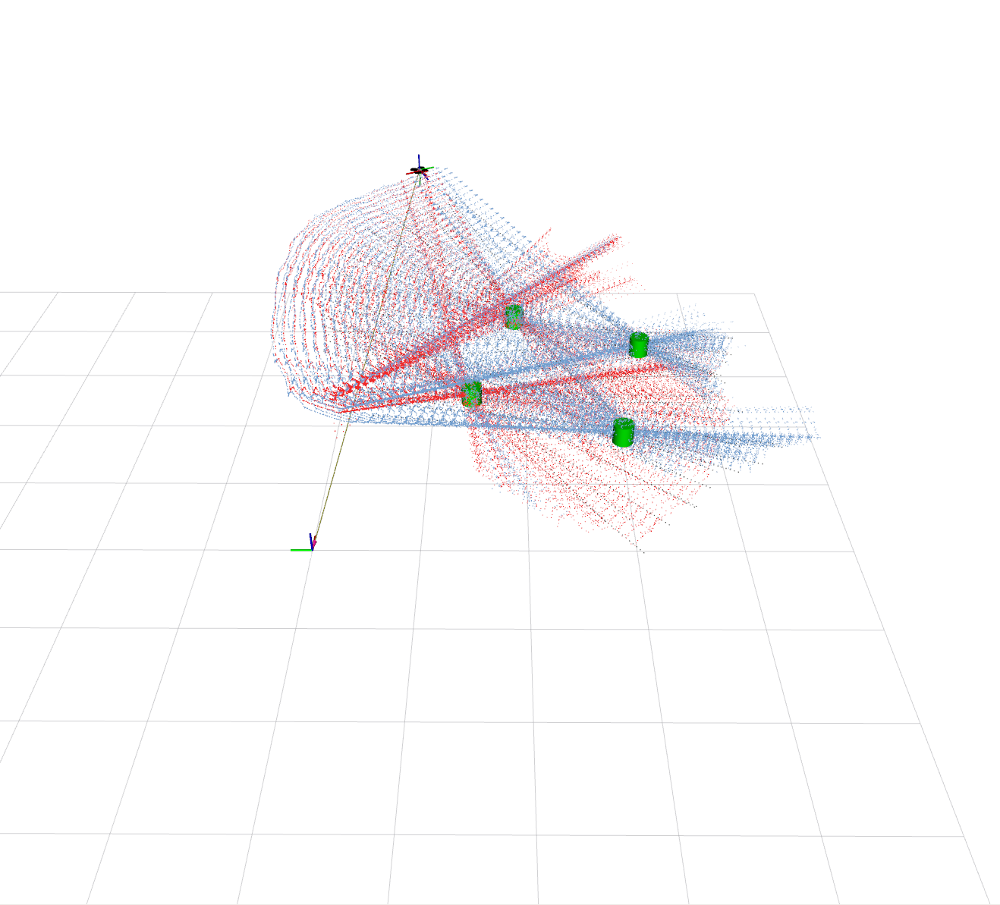

# Localize Plants with tracked bounding boxes
This package is used to localize the objects in 3D based on the pose estimation of the drone or SLAM and the bounding boxes of YOLO

## Overview




**Keywords:** YOLO, Object Detection, Tracking and Localization

### License

The source code is released under a [MIT license](../LICENSE).

**Author: Michael Wachl**  
Affiliation: 
* [Siemens](https://new.siemens.com/global/en.html)<br />
* [TUM-RCS](https://www.ei.tum.de/rcs/startseite/)<br />

Maintainer: Michael Wachl, michael.wachl@tum.de

This package has been tested under [ROS] Melodic and Ubuntu 18.04. This is research code, expect that it changes often and any fitness for a particular purpose is disclaimed.


### Publications

If you use this work in an academic context, please cite the following publication(s):

* Michael Wachl: **Monocular Vision-Based Indoor Object Detection and Localization on Autonomous MAV**. 

        @inproceedings{Wachl2020,
            author = {Michael Wachl},
            title = {{Monocular Vision-Based Indoor Object Detection and Localization on Autonomous MAV}},
            year = {2020}
        }


## Installation

### Dependencies
- [Robot Operating System (ROS)](http://wiki.ros.org) (middleware for robotics)
- [darknet_ros package](/../darknet_ros)
- [sort_track package](/../sort_track)

#### Building

To build from source, clone the latest version from this repository into your catkin workspace and compile the package using

	catkin_make


## Usage/Launch
Make sure tello driver, yolo object detection and the tracker node is launched:
```
roslaunch tello_driver tello_node.launch 
```
```
roslaunch darknet_ros yolov4-tiny-custom_tomato.launch 
```
```
roslaunch sort_track sort.launch 
```
Now the localization node can be launched:
```
roslaunch localize_plants localize_plants.launch 
```

Use teleoperator or MAV controller to fly.
```
rosrun tello_keyboard_teleop tello_keyboard_teleop_2.py 
```
or/and MAV controller with GUI
```
roslaunch tello_controller tello_controller_node.launch 
```
```
rqt
```

## Nodes
`localize_plant_node`

## Config files
Change camera and localization parameter in the files if needed
- [localize_fd143a.yaml](config/localize_fd143a.yaml) (in use)
- [localize.yaml](localize.yaml) (general)


#### Subscribed Topics

* **`/tello/odom`** Odometry
* **`/darknet_ros/found_object`** ObjectCount
* **`/darknet_ros/bounding_boxes`** BoundingBoxes
* **`/sort_tracker/tracked_bounding_boxes`** TrackedBoundingBoxes


#### Published Topics

* **`/plant_localizer/label_one_cloud`** PointCloud
* **`/plant_localizer/label_two_cloud`** PointCloud
* **`/plant_localizer/tracker_cloud`** PointCloud
* **`/plant_marker`** Marker


### Config files
Change camera and localization parameter in the files if needed
- [localize_fd143a.yaml](config/localize_fd143a.yaml) (in use)
- [localize.yaml](localize.yaml) (general)


## Bugs & Feature Requests

Please report bugs and request features using the Issue Tracker
