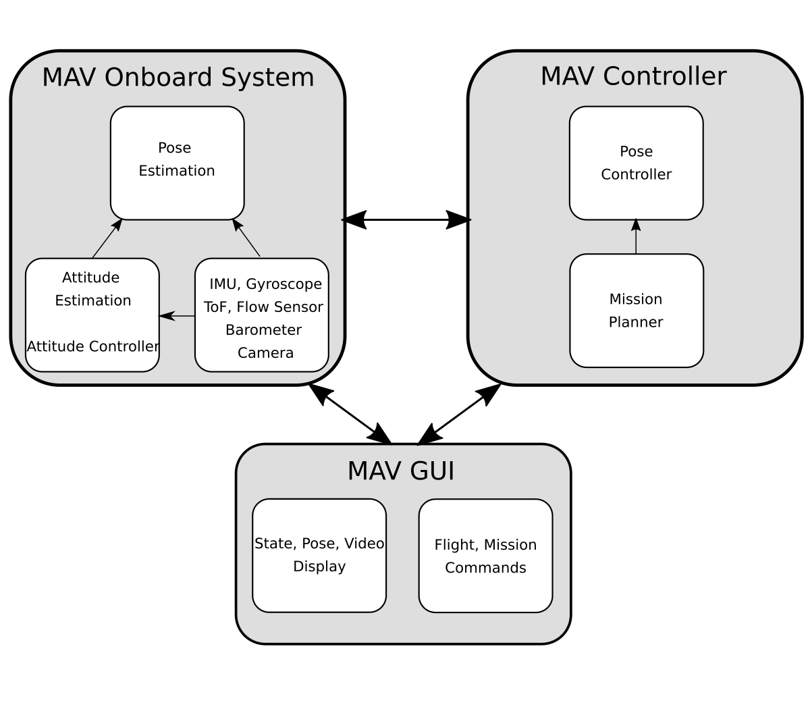

# MAV Controller for Tello Drone 



## Overview
Our MAV controller is designed to compute and publish a path, which the drone then follows and execute predefined missions. Therefore it contains proportional-integral–derivative (PID) controller and a mission planner. It communicates with the GUI and drone over the driver node. From the driver node or SLAM node, i  receives the current pose of the drone and feeds it to the  PID-controllers. Additionally, the current state of the flight and mission is tracked and changed.  For example, if the drone is flying or not, has reached the target position, or if the mission has been stopped. The node also calculate a path based on a target pose.  For example, it can calculate a circular path around a crop that has to be inspected, based on the current position and crop position. Several waypoints are then calculated to follow.  With a threshold, the controller checks if the current position is close enough to the desired position; if true, it controls the drone to the next pose.  Mission states and commands are exchanged between the MAV controller and GUI. Missions can be started, stopped or the drone can be summoned home from the GUI via buttons and the current mission state is displayed. The mission planner keeps track of the current and all target pose and mission states, whereas the position controller sends velocity commands to the drone based on the position difference. The MAV controller can also send takeoff and land commands to the drone and send it back to the base station if the battery reaches a critical level. The trajectory can be configured to any needs. Complex trajectories or single targets are possible.


**Keywords:** PID, Pose Controller, Mission Controller

### License

The source code is released under a [MIT license](../LICENSE).

**Author: Michael Wachl**
Affiliation: 
* [Siemens](https://new.siemens.com/global/en.html)<br />
* [TUM-RCS](https://www.ei.tum.de/rcs/startseite/)<br />

Maintainer: Michael Wachl, michael.wachl@tum.de

The package has been tested under ROS Melodic and Ubuntu 18.04. This is research code, expect that it changes often and any fitness for a particular purpose is disclaimed.

## Installation


### Dependencies

- [Robot Operating System (ROS)](http://wiki.ros.org) (middleware for robotics),


### Building

To build from source, clone the latest version from this repository into your catkin workspace and compile the package using

	catkin_make


## Usage/Launch
```
roslaunch tello_controller tello_controller_node.launch
```

## Config files

Config file in [config](config) folder

* **position_controller.yaml** PID and controller parameters


## Node
`tello_controller_node`

## Additional Files
* [MAV controller implementation and node](scripts/tello_controller.py) 
* [PID controller implementation](scripts/pid.py) 
* [Waypoints templates implementation](scripts/waypoints.py) 
* [Path implementation including circle path](scripts/path.py)
* [Mission state machine implementation](scripts/mission_state.py) 


#### Subscribed Topics

* **`/tello_controller/target_pose`** PoseStamped
* **`/tello/odom`** Odometry
* **`/orb_slam2_mono/pose`** PoseStamped


#### Published Topics

* **`/tello/'cmd_vel`** Twist
* **`/tello/'takeoff`** Empty
* **`/tello/'land`** Empty
* **`/tello_controller/target_path`** Path
* **`/tello_controller/trail_path`** Path
* **`/tello_controller/target_pose`** PoseStamped
* **`/tello_controller/mission_command`** String
* **`/tello_controller/slam_real_world_scale`** Float32


## Bugs & Feature Requests

Please report bugs and request features using the [Issue Tracker](https://github.com/michaelwachl/autonomous_drone_plant_detection/issues).

