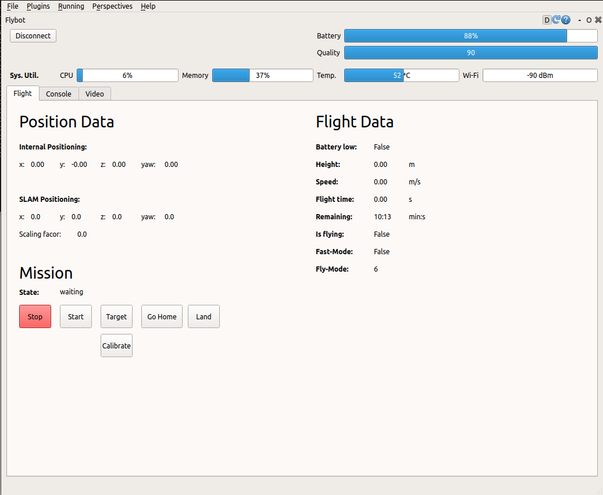
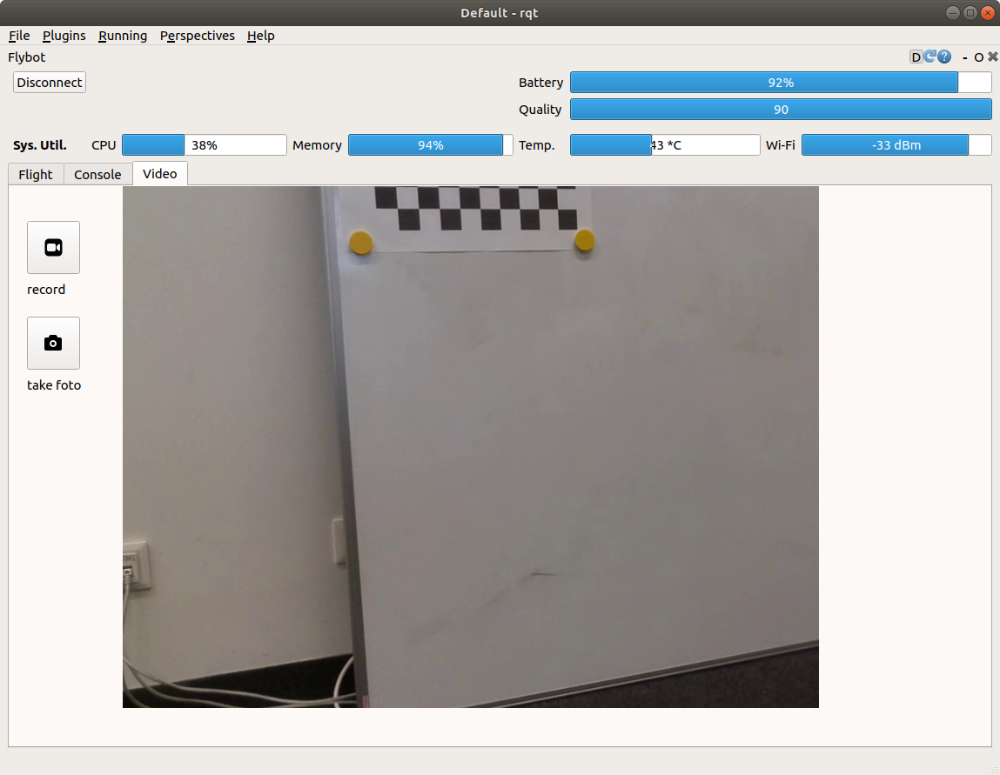

# Environmet Sensor Extension for Tello Drone 






## Overview

This is a [ROS] package used to 

**Keywords:** RQT
### License

The source code is released under a [MIT license](../LICENSE).

**Author: Michael Wachl**
Affiliation: [Siemens](https://new.siemens.com/global/en.html)<br />
             [TUM-RCS](https://www.ei.tum.de/rcs/startseite/)<br />

Maintainer: Michael Wachl, michael.wachl@tum.de

The PACKAGE NAME package has been tested under [ROS] Melodic and Ubuntu 18.04. This is research code, expect that it changes often and any fitness for a particular purpose is disclaimed.


### Publications

If you use this work in an academic context, please cite the following publication(s):

* Michael Wachl: **PAPER TITLE**. 

        @inproceedings{Wachl2020,
            author = {Michael Wachl},
            title = {{MA TITLE}},
            year = {2020}
        }


## Installation

### Installation from Packages

To install all packages from the this repository as Debian packages use

    sudo apt-get install ros-melodic-...

### Building from Source

#### Dependencies

- [Robot Operating System (ROS)](http://wiki.ros.org) (middleware for robotics),
- [Eigen] (linear algebra library)

#### Further preparation
Make sure you allow UDP communication over port 8080 on your machine.

#### Building

To build from source, clone the latest version from this repository into your catkin workspace and compile the package using

	catkin_make


## Usage
If no roscore is running, start one with 
    
    roscore

Then Run the RQT GUI node with

	rqt --standalone tello_rqt_gui --force-discover

or 

```
rqt
``` 

and look for the flybot plugin in the list.


## Nodes

Reads temperature measurements and computed the average.


#### Subscribed Topics

* **`/temperature`** ([sensor_msgs/Temperature])


#### Published Topics

* **`/environment_sensor/scd30`** (environment_sensor.msg/SCD30)


## Bugs & Feature Requests

To change UI, edit the following file:  
[TelloPlugin.ui](src/tello_rqt/resource/TelloPlugin.ui)

afterwards run 
```
GUI_ui_to_py.sh
```
to generate the according Python file.

If PC utility indicator doesn't work, change the internal temperature name in the [system_utility.py](src/tello_rqt/system_utility.py) script.


Please report bugs and request features using the [Issue Tracker](../../issues).

